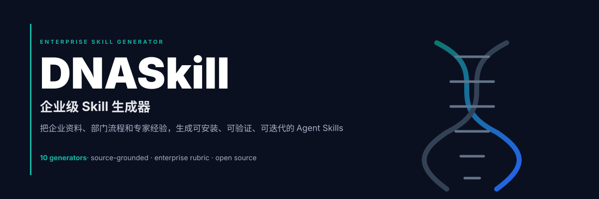

<div align="right">

**[English](README_EN.md)** | 中文

</div>



<div align="center">

# DNASkill

**企业技能生成器：让 AI 学会你的业务知识**

把企业文档转化为结构化、可复用的 AI Skill

[](LICENSE)
[](https://skills.sh)
[](package.json)

```bash
git clone https://github.com/AIPMAndy/DNASkill.git
```

</div>

---

## 👤 关于作者

**我是 Andy**，服务过上千家企业的 AI 落地顾问。

**企业 AI 落地的核心问题不是"模型不够好"，而是"AI 不懂业务"。**

DNASkill 解决这个问题：把企业知识转化为结构化、可验证、可复用的 AI Skill。

---

## 🎯 核心理念

**DNASkill = Claude 的企业技能生成助手 + 质量验证系统**

不是替代 Claude，而是帮助 Claude 更好地生成企业级 AI Skill。

### 工作流程

```
企业文档 → dnaskill init → Claude 生成 → Rubric 验证（85分门槛）→ 部署使用
```

---

## ⚡ 快速开始

### 1. 安装

```bash
# 克隆仓库
git clone https://github.com/AIPMAndy/DNASkill.git
cd DNASkill

# 安装依赖
npm install

# 测试CLI
node src/cli/index.mjs --help
```

### 2. 初始化技能项目

```bash
node src/cli/index.mjs init
```

交互式向导会询问：
- 技能名称（如：customer-support-refund）
- 生成器类型（10种可选）
- 目标部门
- 输入文档路径

### 3. 使用 Claude 生成

在 **Claude Code** 或 **Claude Desktop** 中：

```bash
@dna-skill 请帮我生成一个"客服支持"类型的技能包

## 企业信息
- 技能名称: customer-support-refund
- 目标部门: 客服部
- 生成器类型: customer-support

## 输入文档
1. ./docs/refund-policy.md
2. ./docs/customer-service-manual.md

## 要求
- 生成完整的 SKILL.md + references/ + test-prompts.json
- 确保 Rubric 评分 ≥ 85 分
```

### 4. 验证质量

```bash
# 验证文件结构
node src/cli/index.mjs validate ./generated-skills/xxx/SKILL.md

# Rubric 评分（必须 ≥ 85 分）
node src/cli/index.mjs score ./generated-skills/xxx/SKILL.md
```

---

## 🏆 核心功能

### ✅ 已实现

#### 1. Rubric 自动化评分系统

**9个维度，100分制**，确保生成质量：

| 维度 | 分值 | 检查内容 |
|-----|-----|---------|
| 触发清晰度 | 10分 | frontmatter、description、触发示例 |
| 来源可追溯 | 15分 | source-map.md、来源标注 |
| 工作流具体性 | 15分 | 步骤清晰、输入输出定义 |
| 部门匹配度 | 10分 | domain-brief.md、角色定义 |
| 风险控制 | 15分 | 升级规则、权限边界、禁止行为 |
| 渐进式披露 | 10分 | 核心精简、细节在references/ |
| 测试覆盖 | 10分 | 至少3种测试（正常/缺失/风险） |
| 可复用性 | 5分 | 结构清晰、易于复制 |
| 进化准备度 | 10分 | 反馈机制、改进路径 |

**85分门槛**：低于85分拒绝部署

#### 2. CLI 工具

```bash
dnaskill init              # 初始化技能项目
dnaskill score <path>      # 质量评分（0-100分）
dnaskill validate <path>   # 验证文件结构
dnaskill --help            # 查看帮助
```

#### 3. 10个企业级生成器

- 📞 Customer Support - 客服支持
- 💼 Sales Enablement - 销售赋能
- 🔄 SOP Automation - 流程自动化
- 🎓 Training & Onboarding - 培训入职
- 📋 Compliance & Policy - 合规政策
- 📊 Data Analysis - 数据分析
- 🔗 Workflow Integration - 工作流集成
- 📝 Meeting & Report - 会议报告
- 💡 Decision Advisor - 决策顾问
- 📚 Department Knowledge - 部门知识库

详见：[`references/generator-catalog.md`](references/generator-catalog.md)

#### 4. 完整示例

**客服退款技能**：[`examples/customer-support-refund/`](examples/customer-support-refund/)

- ✅ **Rubric 评分: 87/100**（超过85分门槛）
- ✅ 完整的 SKILL.md（包含触发条件、工作流、风险规则）
- ✅ 3个参考文档（domain-brief、source-map、operating-rules）
- ✅ 6个测试用例（覆盖正常、缺失、风险场景）

---

## 📊 实际验证

### DNASkill 自身评分

```bash
$ node src/cli/index.mjs score ./SKILL.md
Total Score: ❌ 34/100 (34%)
```

**问题**：缺少 references/ 和 test-prompts.json

### 示例技能评分

```bash
$ node src/cli/index.mjs score examples/customer-support-refund/SKILL.md
Total Score: ✅ 87/100 (87%)
Status: Ready with minor review
```

**证明**：按照规范生成的 Skill 可以达到 85 分以上。

---

## 📖 技能包结构

```
skill-name/
├── SKILL.md                      # 核心技能定义（< 500行）
├── references/
│   ├── domain-brief.md           # 部门简介、角色、术语
│   ├── source-map.md             # 来源追溯（owner、时效性、敏感级别）
│   └── operating-rules.md        # 权限、升级、禁止行为
└── test-prompts.json             # 测试用例（至少3个）
```

### SKILL.md 必需章节

```markdown
---
name: skill-name
description: "触发条件和功能描述"
---

## When To Use          # 触发条件
## Required Inputs      # 必需输入
## Workflow             # 工作流程
## Output Format        # 输出格式
## Risk And Escalation  # 风险控制
## Validation           # 验证方法
```

---

## 🎓 设计理念

### Learn → Master → Create → Evolve

DNASkill 让 AI 像人一样学习企业技能：

1. **Learn（学习）** - 读取企业文档，理解业务规则
2. **Master（掌握）** - 通过测试用例练习，达到熟练水平
3. **Create（创造）** - 生成结构化的技能包
4. **Evolve（进化）** - 根据反馈持续改进

详见：[`references/skill-learning-evolution.md`](references/skill-learning-evolution.md)

---

## 🆚 与其他方案对比

### vs 手动写 Prompt

| 对比项 | 手动写 Prompt | DNASkill |
|-------|-------------|----------|
| 结构化 | ❌ 凭感觉 | ✅ 标准化文件结构 |
| 质量保证 | ❌ 无标准 | ✅ Rubric 85分门槛 |
| 可复用 | ❌ 每次从头写 | ✅ 模板+参考文档 |
| 可追溯 | ❌ 无来源标注 | ✅ Source Map |
| 测试覆盖 | ❌ 无测试 | ✅ test-prompts.json |

### vs 通用 AI 平台

| 对比项 | 通用平台 | DNASkill |
|-------|---------|----------|
| 企业定制 | ⚠️ 通用方案 | ✅ 深度定制 |
| 数据隐私 | ⚠️ 上传到平台 | ✅ 本地运行 |
| 成本 | 💰 订阅费用 | ✅ 开源免费 |
| 可控性 | ⚠️ 平台限制 | ✅ 完全掌控 |

---

## 🛠️ 开发

### 运行测试

```bash
npm test                # 运行所有测试
npm run test:watch      # 监听模式
npm run test:coverage   # 代码覆盖率
```

### 目录结构

```
DNASkill/
├── src/
│   ├── cli/              # CLI命令
│   ├── validators/       # Rubric评分器
│   └── utils/            # 工具函数
├── references/           # 设计理念文档
├── templates/            # 技能模板
├── examples/             # 完整示例
├── tests/                # 单元测试
└── docs/                 # 开发文档
```

---

## 📝 路线图

### v0.2.0（当前版本）✅
- ✅ Rubric 自动化评分系统
- ✅ CLI 工具（init/score/validate）
- ✅ 完整示例（87分）
- ✅ 测试框架

### v0.3.0（计划中）
- [ ] 更多真实示例（销售、SOP、培训等）
- [ ] 改进 source-map 检测逻辑
- [ ] 补充更多单元测试
- [ ] GitHub Actions CI/CD

### v0.5.0（未来）
- [ ] 技能市场（分享和下载）
- [ ] 社区贡献机制
- [ ] VS Code 插件
- [ ] 性能优化

---

## 🤝 贡献

欢迎贡献！请阅读 [贡献指南](CONTRIBUTING.md)（待补充）

### 贡献方式

1. **提交示例技能** - 分享你的企业 Skill
2. **改进检测逻辑** - 让 Rubric 更准确
3. **补充测试** - 提高代码覆盖率
4. **完善文档** - 让更多人能用起来

---

## 📄 许可证

[MIT License](LICENSE)

---

## 👤 关于作者

**Andy** - 前大模型独角兽 VP，服务过 50+ 企业做 AI 落地

**联系方式**：
- GitHub: [@AIPMAndy](https://github.com/AIPMAndy)
- 公众号：AI产品经理Andy

---

## ⭐ Star History

如果这个项目对你有帮助，请给个 Star ⭐

[](https://star-history.com/#AIPMAndy/DNASkill&Date)

---

**让 AI 学会你的业务，从 DNASkill 开始。**
