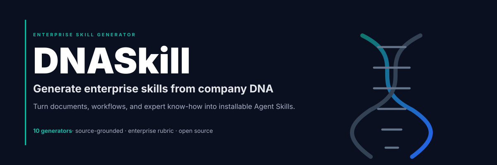

<div align="right">

English | **[中文](README.md)**

</div>



<div align="center">

# DNASkill

**A system that helps AI roles learn skills like humans. It turns company documents, department workflows, and expert know-how into Agent Skills that AI can learn, master, create, and evolve.**

[](LICENSE)
[](https://skills.sh)
[](#)

```bash
npx skills add AIPMAndy/DNASkill
```

</div>

---

## What Changed

DNASkill is not just a prompt generator. It is an AI role skill system.

It focuses on four capabilities:

- **Learn skills like humans**: read sources, observe examples, understand a
  role, then practice from simple tasks to complex ones.
- **Master skills**: practice on realistic business prompts and improve weak
  steps through feedback.
- **Create skills**: package mastered behavior into `SKILL.md`, references,
  tests, and risk rules.
- **Evolve skills**: record failures, reflect on causes, update tests, and
  promote only better versions.

```text
Learn -> Master -> Create -> Evolve
```

DNASkill helps AI roles learn, master, create, and evolve enterprise skills.

---

## Why This Exists

Enterprises do not need one generic chatbot. They need a portfolio of focused
skills that understand department knowledge, operating procedures, permissions,
internal vocabulary, and expected outputs.

DNASkill converts enterprise material into reusable skills:

- department documents, SOPs, policies, and training material
- customer support scripts and escalation rules
- sales playbooks, product decks, and customer profiles
- meeting notes, weekly reports, and project reviews
- metric definitions, data dictionaries, and dashboard guidance
- internal tools, APIs, approval flows, and permission rules

The goal is to help a company generate its first 10 high-value enterprise skills,
then expand that into an internal AI role skill factory.

---

## What It Generates

DNASkill produces complete skill packages, not loose prompts:

```text
skill-name/
├── SKILL.md
├── references/
│   ├── domain-brief.md
│   ├── source-map.md
│   └── operating-rules.md
├── scripts/
│   └── validate-inputs.mjs
└── test-prompts.json
```

Each generated skill includes triggers, workflows, source references, risk
boundaries, validation prompts, and a quality score.

More importantly, each skill can keep learning: new practice prompts, feedback,
reflection notes, and tests help the AI role move from knowing the process to
performing it reliably.

---

## The 10 Enterprise Generators

| # | Generator | Best For |
|---:|---|---|
| 1 | Department Knowledge Skill | Department knowledge bases and role-specific Q&A |
| 2 | SOP Automation Skill | Standard operating procedures and approval steps |
| 3 | Customer Support Skill | Support scripts, ticket triage, escalation rules |
| 4 | Sales Enablement Skill | Sales scripts, customer profiles, proposal drafting |
| 5 | Onboarding And Training Skill | New-hire training and role learning paths |
| 6 | Compliance And Policy Skill | Policy lookup, compliance boundaries, risk alerts |
| 7 | Data Analysis Skill | Metric definitions, dashboard interpretation, analysis |
| 8 | Workflow Integration Skill | Internal tools, APIs, and cross-system processes |
| 9 | Meeting And Reporting Skill | Meeting summaries, weekly reports, project reviews |
| 10 | Decision Advisor Skill | Business decisions, trade-off analysis, recommendations |

---

## Workflow

1. Capture the enterprise DNA: departments, roles, workflows, tools, documents,
   permissions, and output standards.
2. Build a source map: owner, freshness, sensitivity, and confidence for every
   source.
3. Select one generator pattern from the catalog.
4. Generate a skill package with `SKILL.md`, references, optional scripts, and
   `test-prompts.json`.
5. Validate the package with a 100-point enterprise readiness rubric.
6. Handoff install steps, assumptions, gaps, and next recommended skills.

---

## Evolution Strategy

DNASkill uses four practical learning strategies:

- **Curriculum ladder**: move from simple tasks to complex tasks.
- **Skill library**: store successful skills so future tasks can retrieve and compose them.
- **Reflective memory**: turn failures and feedback into reusable improvement notes.
- **Deliberate practice**: create focused practice prompts for weak steps.

See [`references/skill-learning-evolution.md`](references/skill-learning-evolution.md).

---

## Quick Start

Install:

```bash
npx skills add AIPMAndy/DNASkill
```

Example requests:

```text
Generate an enterprise customer support skill from our SOP, support scripts, and ticket escalation rules.
```

```text
Use these sales training docs, product notes, and customer profiles to create a Sales Enablement Skill.
```

```text
Create a project reporting skill from these meeting notes and weekly report templates.
```

---

## License

MIT. Do not commit real enterprise confidential material to a public repository.
Use redacted templates and synthetic examples for open-source distribution.
